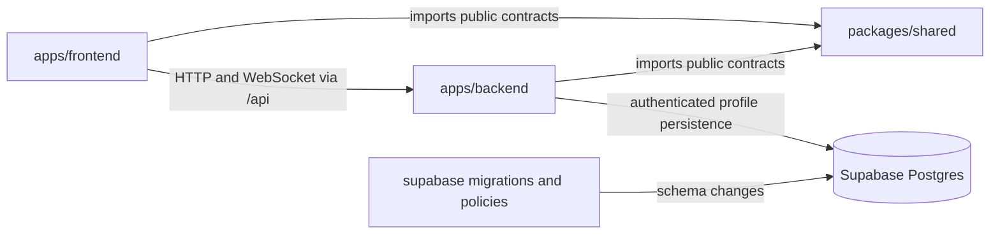

# Repository architecture

Thinkink uses a small npm-workspaces monorepo. Application source, database definitions and common contracts have separate owners while related changes can be reviewed in one pull request.

This is a project-specific design informed by [npm workspaces](https://docs.npmjs.com/cli/v11/using-npm/workspaces/), [Supabase migrations](https://supabase.com/docs/guides/local-development/database-migrations), and [Cloudflare Static Assets](https://developers.cloudflare.com/workers/static-assets/). Those tools do not prescribe a universal professional folder tree.

## Ownership

| Area              | Owns                                                                                  | Must not contain                                                      |
| ----------------- | ------------------------------------------------------------------------------------- | --------------------------------------------------------------------- |
| `apps/frontend`   | React, Mission HTML, CSS, browser API client, Vite config                             | Worker code, database credentials, provider clients                   |
| `apps/backend`    | Worker routes, server policies, topic rooms and persistence adapters, Wrangler config | React components, copies of SQL migrations                            |
| `packages/shared` | Public API schemas, inferred types, common timing constants                           | Application imports, secrets, database access or scheduling decisions |
| `supabase`        | SQL migrations, constraints, RLS, database tests and local service config             | Real user data, dumps, Docker volumes                                 |
| `tests/e2e`       | Whole-application browser behavior                                                    | News/AI calls, hosted credentials or real user data                   |
| Root tooling      | npm orchestration, lockfile, lint rules, CI and formatting                            | Mixed application runtime dependencies                                |

The backend's `src/domain/refresh-policy.ts` owns refresh eligibility. The shared timing module only exposes constants. Database row types will belong to backend persistence code; public API contracts should not expose internal rows or private author mappings.

## Dependency direction

Neither application exports its private source as a package API. Shared imports use explicit exports such as `@thinkink/shared/contracts`; relative traversal into the package is rejected by lint. Frontend/backend imports and frontend server-runtime imports are also rejected. Shared code cannot import either application.

Runtime TypeScript checks are separate: the frontend uses DOM/Vite types, the backend uses Wrangler-generated Workers types, and Node-based tooling/tests have their own configuration. This makes accidental browser or Node globals in Worker source visible during checking.

## Development, build and deployment

Root `npm run dev` prepares assets and starts Vite and Wrangler as separate local processes. Vite forwards `/api` HTTP and WebSocket traffic to Wrangler. Its file-serving allowlist includes frontend, shared code and installed dependencies, excluding backend source and local backend secrets.

`npm run build:frontend` produces browser files and Mission HTML in `apps/frontend/dist`. `npm run build:backend` generates runtime types, checks backend code and performs a Wrangler dry run into `apps/backend/dist`; frontend assets must already exist. Root `npm run build` runs both in the required order.

`npm run preview` uses the compiled Worker and frontend assets through local Wrangler. Automated browser tests target this preview. Development and preview commands explicitly disable remote bindings.

Production remains one Cloudflare Worker with Static Assets per environment. Source separation does not require two domains, duplicate deployments or browser CORS configuration. The backend exports the SQLite-backed `TopicRoom` class for hibernating WebSockets; Supabase remains a separately managed data service.

## Database lifecycle

The root `supabase/` layout follows the CLI convention. It is separate from both applications and has root-level database commands. A SQL/TOML project does not need a placeholder JavaScript workspace.

Version schema, grants, RLS policies and database functions together. Add tests with the first migration. Do not edit already-applied shared migrations or assume reverting Worker code reverses a database change. Local, staging and production have separate data and secrets.

The account milestone implements `public.profiles` with an Auth trigger, column-level grants and owner-only RLS policies. SQL tests cover anonymous denial, owner updates and cross-user denial. The existing local Docker project keeps the ID `thinkink`. Authentication routes and request-scoped Supabase clients live in `apps/backend/src/auth`; the frontend receives only validated account projections and keeps tokens out of JavaScript.

## Repository scale

Use one installation and lockfile. Add dependencies to their owning workspace; common tools such as ESLint, Playwright and Supabase CLI live at the root. A hoisted `node_modules` directory is an installation detail, not permission for cross-application imports.

Do not create empty service, repository, adapter or component layers until there is code that needs them. This project currently does not need separate Git repositories, an internal package registry, Nx/Turborepo or a custom Docker Compose stack duplicating the Supabase CLI. Revisit those choices only when build time, independent ownership or deployment requirements justify them.

## Live discussion

Each topic has a stable Durable Object selected with `idFromName(topicId)`. Postgres commits comments, likes and the discussion revision atomically; the room broadcasts public revision changes and the browser reloads authorized snapshots. An alarm recovers missed notifications while readers are connected. No news or AI refresh is scheduled. See [the protocol and tests](realtime.md).
